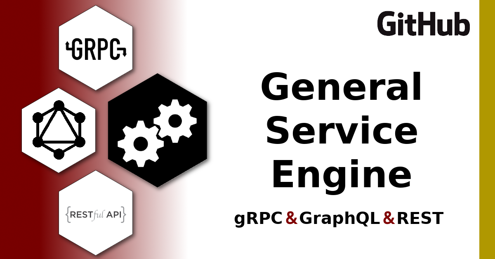

# General Service Engine Template

This project is a containerized implementation of [**`service-engine`**](https://www.npmjs.com/package/service-engine). The goal is to provide a minimalist template that can be used to quickly bootstap services.

This project currently supports PostgreSQL, MySQL and Sqlite3. Support for all other database dialects supported by [knex.js](http://knexjs.org) is planned.



#  <a id="table-of-contents"></a>Table of Contents
* [Application Configuration](#application_configuration)
    * [Required](#required)
    * [Optional](#optional)
* [Quick Start](#quick_start)
    * [Basic Features](#quick_start-basic_features)
    * [Custom Functionality & Schema Migration Support](#quick_start-custom_functionality)
* [Schema Migrations](#schema_migrations)
    * [Basic Schema Migrations via knex.js](#schema_migrations-basic)
    * [Modular Schema Migration Scripts](#schema_migrations-modular)
* [API Documentation](#api_documentation)
    * [OpenAPI UI](#api_documentation-open_api_ui)
    * [OpenAPI Import](#api_documentation-insomnia_openapi_import)
    * [Static HTML Documentation](#api_documentation-static_html_documentation)
* [Setup & Feature Video Walkthrough](#video-walkthrough-setup-and-features)
* [Versioning](#versioning)
* [License](#license)

# <a id="application_configuration"></a> Application Configuration

## <a id="required"></a> Required

### <a id="env"></a> `.env`

Mostly consists of DB Connection information, but also includes options for pagination limits, ports for `REST` & `gRPC` services & a flag indicated if you want to enable db migrations on startup.

### <a id="metadata_json"></a> `metadata.json`

Most of this content is used to complete the OpenAPI docs. However, the **appShortName** is also used to define root URL path & is injected into all logs.

## <a id="optional"></a> Optional

The remaining files are all optional. Detailed descriptions of what each is for is documented on the **README** of the root project.

- [`middleware.js`](https://github.com/sudowing/service-engine/blob/develop/README.md#application-configurations_middleware)
- [`complex_resources.js`](https://github.com/sudowing/service-engine/blob/develop/README.md#application-configurations_complex-resources-subqueries)
- [`permissions.js`](https://github.com/sudowing/service-engine/blob/develop/README.md#application-configurations_permissions)
- [`redactions.js`](https://github.com/sudowing/service-engine#application-configurations_redacted_fields)


# <a id="quick_start"></a> Quick Start

## <a id="quick_start-basic_features"></a> Basic Features

Once database configurations are set in a `.env` file, you can run the application via a Docker container. The resources provisioned for `REST`, `GraphQL` & `gRPC` are fully derived from the database. 

```sh
# create docker network (if db on docker network)
docker network create mynetwork

# run via docker container
docker run --rm -d \
	--network mynetwork \
	--env-file ./.env \
	-p 8080:8080 \
	-p 50051:50051 \
	--name myservice \
	sudowing/service-engine:latest
```

The services should now be running:  
- [Health Check Route](http://localhost:8080/healthz)
- [OpenAPI3 Definitions](http://localhost:8080/openapi)
- [GraphQL Playground](http://localhost:8080/some-app-service/graphql/)  

Notes:

- Docker run `--network` flag is only needed if you want ton connect to DB service via Docker Network.

- `DB_HOST` should be ip, domain or docker container name. If container name ensure db and this service on same network.

- GraphQL Playground UI is only functional if ENV VAR **`NODE_ENV`** = `development`.


## <a id="quick_start-custom_functionality"></a> Custom Functionality & Schema Migration Support

Additional functionality can be configured by mounting any of the files below into the container. Each file can be enabled individually. 

```sh
# create docker network (if db on docker network)
docker network create mynetwork

# run via docker container
docker run --rm -d \
	--network mynetwork \
	--env-file ./.env \
	-v $(pwd)/src/metadata.json:/app/lib/metadata.json \
	-v $(pwd)/src/permissions.js:/app/lib/permissions.js \
	-v $(pwd)/src/middleware.js:/app/lib/middleware.js \
	-v $(pwd)/src/redactions.js:/app/lib/redactions.js \
	-v $(pwd)/src/complex_resources.js:/app/lib/complex_resources.js \
	-v $(pwd)/migrations:/app/migrations \
	-p 8080:8080 \
	-p 50051:50051 \
	--name myservice \
	sudowing/service-engine:1
```

The services should now be running:  
- [Health Check Route](http://localhost:8080/healthz)
- [OpenAPI3 Definitions](http://localhost:8080/openapi)
- [GraphQL Playground](http://localhost:8080/some-app-service/graphql/)  

# <a id="schema_migrations"></a> Schema Migrations

Knex is used for database schema migrations.

All functionality provided by knex is supported -- along with some project specific features which support more modular schema migrations via batches of SQL files held within specific directories.

## <a id="schema_migrations-basic"></a> Basic Schema Migrations via knex.js

[**Documentation from NPM Package**](https://github.com/sudowing/service-engine-docker#basic-schema-migrations)

```sh
# knex schema migration support via redefining Docker CMDs
docker run --rm \
	--env-file ./.env \
	-v $(pwd)/migrations:/app/migrations \
	sudowing/service-engine:1 \
	npm run migrate:make some_script_name

# ANY/ALL OF THE BELOW LINES ARE SUPPORTED
docker run ...options sudowing/service-engine:1 \
	# create new knex migration script
	npm run migrate:make some_script_name
	# run all pending migration scripts
	npm run migrate:latest
	# rollback all migration scripts committing in last batch
	npm run migrate:rollback
	# rollback all migration scripts
	npm run migrate:rollback-all
	# run next pending migration script
	npm run migrate:up
	# uncommit last committed migration script
	npm run migrate:down
	# list all migration script along with commitment status
	npm run migrate:list
```

## <a id="schema_migrations-modular"></a> Modular Schema Migration Scripts

- [**Documentation from NPM Package**](https://github.com/sudowing/service-engine-docker#modular-schema-migration-scripts)

```sh
# create modular knex schema migration script
docker run --rm \
	--env-file ./.env \
	-v $(pwd)/migrations:/app/migrations \
	sudowing/service-engine:1 \
	npm run migrate:new hello world
```

# <a id="api_documentation"></a> API Documentation

The service has a two sets of resources -- some [static development resources](https://github.com/sudowing/service-engine#rest-endpoints) and others that are generated dynamically that are specific to the database.

I use the [`Insomnia API Client`](insomnia.rest) for develoment, and I've included an [insomnia workplace export](./docs/insomnia.service.json) of some general service calls to speed your adoption.

## <a id="api_documentation-open_api_ui"></a> OpenAPI UI

The OpenAPI UI is available via [Docker Container](https://hub.docker.com/r/swaggerapi/swagger-ui/) and the command below will run that container and populate it with the `OpenAPI definition` generated from this server.

```sh
docker run -p 8088:8080 -e API_URL='http://localhost:8080/openapi' swaggerapi/swagger-ui
```

The services should now be running:  
[OpenAPI Web UI](http://localhost:8088)

## <a id="api_documentation-insomnia_openapi_import"></a> OpenAPI Import

Insomnia has a feature that supports [importing OpenAPI definitions](https://support.insomnia.rest/article/52-importing-and-exporting-data) and because the `REST` service auto-generates OpenAPI3 definitions. This means you can actually use the service to build calls in the insomnia workplace.

This is really helpful for documenting the `REST` calls, but you will have to build `GraphQL` calls out manually.


## <a id="api_documentation-static_html_documentation"></a> Static HTML Documentation

You can also generate some awesome static HTML documentation using [Mermade/shins](https://github.com/Mermade/shins). Tip: I always use the `--inline` flag when generating the shin docs.

**`Mermade/shins`** does not take the OpenAPI docs as input directly -- but rather a markdown format. You can generate this intermediate format using a related Mermade project [widdershins](https://github.com/Mermade/widdershins)
```sh
# use local node winddershins to generate intermediate md
npx widdershins \
 --search true \
 --language_tabs 'javascript:JavaScript' 'javascript--nodejs:Node.JS' 'python:Python' 'go:Go' 'http:HTTP' 'ruby:Ruby' \
 --summary http://localhost:8080/openapi \
 -o docs/service.md
```	

Notes:
- You will need node installed locally to use `npx`
- [shins](https://github.com/Mermade/shins) has been replaced by [reslate](https://github.com/Mermade/reslate). Support for building out static HTML with `reslate` will be added in the future (likely via Docker container).

# <a id="video-walkthrough-setup-and-features"></a>Setup & Feature Video Walkthrough

A series of videos, showing how to configure the application and how several features work, have been published as a [playlist on YouTube](https://www.youtube.com/playlist?list=PLxiODQNSQfKOVmNZ1ZPXbPh6LeVDWtDRc).

Videos have been produced covering the following topics related to setup & Features:
- [GIS DB Setup & Load](https://youtu.be/UjvvPgdT_Y8)
- [Quick Start](https://youtu.be/zwpPLM5LPgo)
- [Insomnia Import](https://youtu.be/PzV19iHs-IU)
- [Key REST Endpoints](https://youtu.be/sfmAO4pWC14)
- [Permissions](https://youtu.be/4ptSSnaqvqw)
- [API Response Metadata](https://youtu.be/fjuTBT08ELE)
- [Query Context](https://youtu.be/wITo_oHjSvM)
- [SQL Operators](https://youtu.be/698lXrclFIs)
- [CRUD Operations](https://youtu.be/KUDqqlxb26M)
- [Debug Mode](https://youtu.be/LjRpv6JZxhI)
- [Complex Resources (subqueries & aggregate queries)](https://youtu.be/rzhQlPAoVeI)
- [Middleware & Redactions](https://youtu.be/AopYx2XM3yc)
- [GraphQL Playground and Geoqueries](https://youtu.be/8y5BMjHVRUA)
- [gRPC Service (CRUD & Geoqueries)](https://youtu.be/HFzwwLIqrfQ)
- [DB Schema Migrations](https://youtu.be/84D8_--K5cs)

# <a id="versioning"></a> Versioning

[SemVer](http://semver.org/) is used for versioning. For the versions available, see the [tags on this repository](https://github.com/sudowing/service-engine-template/tags). 

# <a id="license"></a> License

This project is licensed under the MIT License - see the [LICENSE.md](LICENSE.md) file for details


